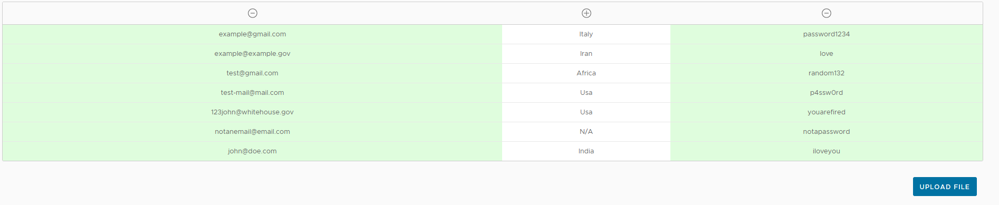

# Dump Hub 

  

Self hosted search engine for data leaks and password dumps. Upload and parse multiple files, then quickly search through all stored items with the power of Elasticsearch.  
   
**Disclaimer:** *This project does not include, and will never include, any data. Data must be uploaded by end users on their own instances of Dump Hub. I take no responsability for the nature of uploaded data.*  

## Running with Docker
Dump Hub can be executed by using docker-compose:
```
git clone https://github.com/x0e1f/dump-hub.git
cd dump-hub
docker-compose up --build
```
The following images will be executed:   
* dump-hub-fe
* dump-hub-be
* elasticsearch

Dump Hub will bind port 443 on 0.0.0.0 by default.  
     
**Warning:** *Do not expose Dump Hub on public networks! Please edit the **docker-compose.yml** file to fit your needs, evaluate to use your own SSL certificate and evaluate the usage of basic auth on nginx.*

## Usage
To start using Dump Hub open a web browser on https://[dump-hub-ip].    

**Warning:** *When you upload a file on Dump Hub, the entries will be parsed and indexed on Elasticsearch. You will be able to perform search queries on every field really quickly, but this comes at a cost: **bigger disk usage**. Keep that in mind if you need to work with a lot of data!*

### Manual file upload:
To upload a new file manually, navigate to the upload page and select the desired file. The preview section will display first 20 lines of that file. In order to correctly parse entries change the parse pattern by clicking on the wrench icon:   
* **Separator:** This is the separator character. This char will be used to split entries on line (just like a standard csv).    
* **Comment character:** Lines starting with this character will not be parsed and will not be displayed in the preview box.  
     
If the parser is correctly configured you will be able to see parsed items as columns in the table at the bottom of the page:

From this table you can select which columns will be parsed and included in the final document (highlighted in green). Each of those fields will be indexed as text and will be fully searchable. In this example the first document would look like this:
```
test.txt (8295558204aa98b6f8aa67e41c8629b15f8f7dd4a100159fc9b417be968fb906)

example@gmail.com
password1234
```

## License
The MIT License (MIT)

Copyright (c) 2021 Davide Pataracchia

Permission is hereby granted, free of charge, to any person obtaining a copy of this software and associated documentation files (the "Software"), to deal in the Software without restriction, including without limitation the rights to use, copy, modify, merge, publish, distribute, sublicense, and/or sell copies of the Software, and to permit persons to whom the Software is furnished to do so, subject to the following conditions:

The above copyright notice and this permission notice shall be included in all copies or substantial portions of the Software.

THE SOFTWARE IS PROVIDED "AS IS", WITHOUT WARRANTY OF ANY KIND, EXPRESS OR IMPLIED, INCLUDING BUT NOT LIMITED TO THE WARRANTIES OF MERCHANTABILITY, FITNESS FOR A PARTICULAR PURPOSE AND NONINFRINGEMENT. IN NO EVENT SHALL THE AUTHORS OR COPYRIGHT HOLDERS BE LIABLE FOR ANY CLAIM, DAMAGES OR OTHER LIABILITY, WHETHER IN AN ACTION OF CONTRACT, TORT OR OTHERWISE, ARISING FROM, OUT OF OR IN CONNECTION WITH THE SOFTWARE OR THE USE OR OTHER DEALINGS IN THE SOFTWARE.
